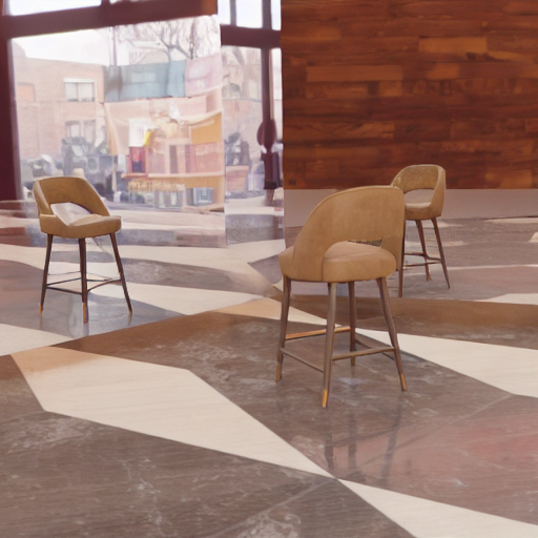

<details align="center">
  <summary>🔀 Fork Notice</summary>
  <p>
  - Original README preserved in <code>README_original_reflecting_reality.md</code>  
  - This file documents my custom changes in this fork  
  </p>
</details>

# Reflecting-Reality-dual-mirror

## Contributors

- [Kudupudi Mohan Kumar](https://github.com/kudupudimohankumar2)  
- [Kanika Bikshapathi](https://github.com/bhikshapathi-iisc)  

## Abstract:
Generate realistic mirror reflections in two mirrors using diffusion models formulating it as an inpainting task. Here, we also condition the diffusion model with depth information to generate realistic mirror reflections in the generated images.
Depth Cue are used to
- Reason about object distance and shapes for accurate reflections  
- 3D understanding is needed; 2D inpainting is suboptimal  
- Inject 3D cues during inpainting using depth maps  
- Depth maps enable generating accurate, consistent reflections that adhere to 3D scene structure  

We created a dataset containing images with two mirrors and reflections of objects in the scene. This dataset is used to train the same Mirrorfusion model to generate realistic mirror reflections in two mirrors. The dataset is created using the following steps:

**Image Generation**: 
    - Use BlenderProc to generate images with two mirrors and reflections of objects in the scene.  

Dataset : Dual Mirror dataset https://huggingface.co/datasets/Bhikshapathi/Dual_mirror

copy the dataset to folder 'data' in Mirrorfusion directory. The dataset is structured as below:

```
MirrorFusion/
    data/
        blenderproc/
            abo_v3/
                0/
                    B00BBDF500/
                        0.hdf5
                        1.hdf5
                        2.hdf5
            ...
            train.csv
            test.csv
```

The training is done as suggested in README file in the Mirrorfusion directory but using this Dual Mirror dataset.

The following are the checkpoints that are obtained after training the Mirrorfusion model on the Dual Mirror Dataset. One checkpoint is obtained by training the Mirrorfusion model with frozen U-Net trained for 20000 train steps and the other checkpoint is obtained by training the Mirrorfusion model with trainable U-Net, trained for 15000 train steps. The checkpoints are available in the following links:
- [Mirrorfusion with dual mirror](https://huggingface.co/mohan12359/dual_mirror_models)

These checkpoints can be used to inferance and evaluation of the model as give in README file in Mirrorfusion directory. 

The sample images generated using the above checkpoint is shown below.
<div align="center">



</div>

